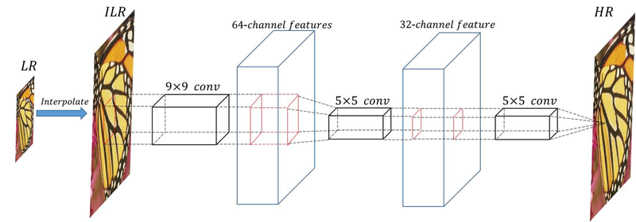
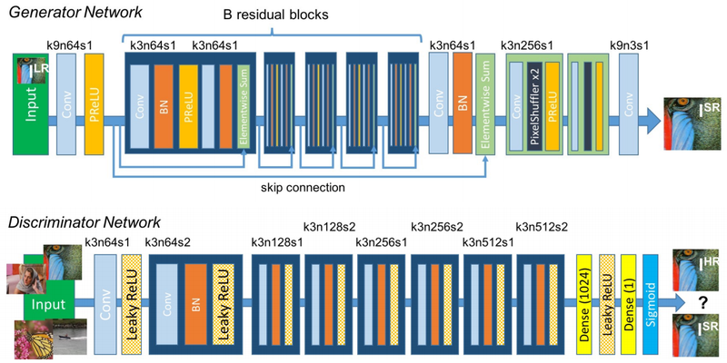

Super Resolution & GAN
=
> # 목차
> ---
> ## 1. 목표 및 의의    
> ## 2. 이론 [go](#2-이론)    
>   > 1 [Interpolation](#1-intrepolation)    
>   > 2 [SRCNN & SRGAN](#2-srcnn-srgan)     
>   > 3 [Super Resolution 결과 평가하기](#3-super-resolution-결과-평가하기)     
> ## 3. 코드 분석 [go](#3-코드-분석)     
>   > [1 SRCNN 구현하기](#1-srcnn-구현하기)
>   > [2 SRGAN 구현하기](#2-srgan-구현하기)
>   > [4 Super Resolution 평가하기](#4-)     
> ## 4. 아쉬운 점 [go](#4-아쉬운-점)     

   

- - - -

# 1. 목표 및 의의     

## 1) 이미지 복원 원리에 대해 알아본다.    

## 2) 이미지 복원 모델을 재현해보고, 모델을 구현할 수 있다.     

   

- - - - 
# 2. 이론
[목차](#super-resolution--gan)

## 1) Interpolation 
### 저해상도 이미지를 고해상도 이미지로 바꾸고 싶으며 어떻게 해야할까요? 한번 예를 들어보겠습니다. 30x40 사이즈의 이미지가 있습니다. 이 이미지를 300x400사이즈의 이미지로 업그레이드 하고 싶으면 어떻게 해야할까요? 일단 30x40사이즈 이미지의 픽셀과 픽셀 사이에 상하 좌우가 10배가 되도록 픽셀을 채워넣어야 할 것입니다. 그렇다면, 픽셀을 채워넣어서 어떠한 값을 할당해 주어야 할텐데, 어떤 값을 넣어주면 될까요? 이와같은 고민을 해결해주는 것으로 Interpolation(보간법)이라는 기술이 있습니다. Bilinear Interpolation(2차원 선형보간법), Bicubic Interpolation(2차원 삼차보간법), 등 다양한 보간법이 있으며, 각기 다른 방법으로 새로 추가한 픽셀들의 값을 결정해주게 됩니다.

### $\bullet$ Linear Interpolation(선형보간법)     
> ### 선형보간법에서는 현 문제가 단순히 이미 값이 존재하는 픽셀을 양 끝에 놓고, 그 사이의 데이터를 채우는 상황으로 묘사됩니다. 이 보강법은 이름 그대로 선형성을 따져서, 사전에 값이 존재하는 픽셀을 포함한 각 픽셀들이 등차의 관계를 유지하도록, 보강하게 됩니다. 1차적으로는 가장 자연스러운 방법이라고 생각할 수 있지만, 잘 생각해보면, 매끄러운 곡선이 있는 이미지에서는 선의 일부를 직선으로만 바꿔주는 문제가 있을 수 있습니다. 이것을 보강할 방법을 생각해보면 자연스럽게 삼차 보간법으로 흐름이 넘어가게 됩니다.    

### $\bullet$ Cubic Interpolation(삼차보간법)      
> ### 삼차보간법이 선형보간법과 다른 핵심적인 아이디어는 사전에 존재하는 픽셀을 양끝점으로 두고 그 점으로부터만 값을 계산하는 방법을 바꾸어, 양끝점 픽셀 바깥의 점까지 하나 추가하여 본다고 할 수 있습니다. 이렇게 보다 여러개의 점을 확인하여, 3차 함수를 유도하여 문제를 해결합니다. 보간된 픽셀들은 보다 많은 정보를 확인하고 결정해주었기 때문에, 보다 자연스러운 값을 예측할 수 있습니다.

하지만 이렇게 예측한 값들이 있다 하더라도, 당연히 실제 값을 그대로 맞출 수는 없습니다. 보다 자연스럽게 이미지를 고해상도로 만드려는 노력이 있습니다. 바로 딥러닝을 사용하여, 모델이 픽셀의 값을 맞추도록 하는 것입니다. 

## 2) SRCNN & SRGAN

### 아래와 같이 단순이 conv2d layer를 몇겹 쌓아서, 이미지를 보강할 수 있습니다.   

### 보기에는 단순해보이지만, 이러한 시도로 딥러닝으로 이미지를 보강하려는 다양한 시도가 나타나게 됩니다. 그로써 저희가 오늘 다뤄볼 SRGAN이 탄생하게 됩니다.   

### 원리는 일반적인 GAN과 같습니다. CNN과 비교하여 우수한 점은, 이미지 보강에 원래 올바른 답변은 없다는 것입니다. SRCNN은 답을 보고 MSE를 통해 정답을 학습하여, 실제와 비슷한 보강을 하는 법을 배운다면, SRGAN에서는 실제 정답으로 학습을 할수는 없는 대신, 실제 같아보이는 이미지를 만들도록 학습할 수 있는 것입니다. 원래 정답이 없는 상황에 오히려 잘 맞는 학습법이라는 생각이 듭니다.

## 3) Super Resolution 결과 평가하기

### 이미지 보강의 결과를 평가하는데에는 많은 어려움이 따릅니다. 원본과 얼마나 비슷한지, 결국 사람의 마음에 들어야하기 때문입니다. 하지만 몇가지 정량적 기준을 가지고 있습니다.

- PSNR(Peak Signal-to-Noise Ratio)
단순히 이미지 픽셀의 최대값인 255를 MSE로 나눈 값에 상용로그를 취한 값입니다. 최대값이 동일하지 않은 상황에서는, MSE로 얼마나 잘 보강되었는지 비교하기가 적절치 않기때문에, 비율로서 비교한다고 생각하면 되겠습니다. 다만 MSE를 역수취한 값을 반영하기 때문에, 점수는 높을 수록 이미지 보강이 잘 되는 것입니다. dB(데시벨)단위를 사용합니다. 하지만 이것은 MSE가 낮도록 직접 학습시킨 SRCNN이 오히려 더 좋은 점수를 얻을 것입니다. 어떻게 이 문제를 해결할 수 있을까요?

- SSIM(Structural Similarity Index Map)
이미지 품질 평가(image quality assessment)에 가장 영향력있는 방법으로 지역적으로 이미지의 평균밝기, 표준편차, 구조 이상 세가지에 대한 원본이미지와의 비교값(1일수록 원본과 같음)을 각각 곱하여, SSI(Structural Similarity Index) 하나의 값을 얻는 방법입니다. 지역적으로 얻은 값이기 때문에, 전체 이미지에서 각각 부분에서 값을 얻어 나타나는 것이 SSIM(Structural Similarity Index Map)이며, 여기서 전체를 산술평균 한 값으로 score를 얻습니다. 1보다 작으며, 1에 가까울 수록 우수한 품질입니다.

### 이렇게  몇가지 방법을 들어볼 수 있는데, 한번 직접 어떠한 결과를 나타내는지 확인해보도록 합시다!

    

- - - -
# 3. [코드 분석](https://nbviewer.org/github/SunCreation/aiffel/blob/main/Working/AI/Super_Resolution/%5BEX-16%5D.ipynb#super-resolution-gan) __클릭!__

[목차](#super-resolution--gan)
- - - -

