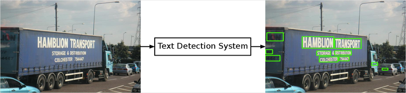
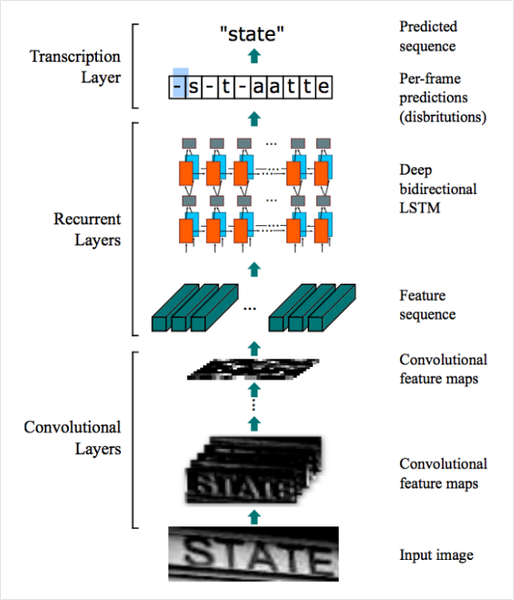

18-5. 사진 속 문자 찾아내기 - detection
=

[출처: https://www.semanticscholar.org/paper/End-To-End-Text-Detection-Using-Deep-Learning-Ibrahim/6d8584a900bd77afec55921c2d2d1cb6f1244b25/figure/0]
사진 속 문자를 찾아내는 최근의 딥러닝 모델은 일반적인 Object Detection(객체 인식) 방법으로 접근합니다. 이미지 속에서 물체를 찾아내는 딥러닝 모델에게 문자를 찾도록 학습을 시킨 것이죠. 물론 문자의 특성에 따라서 모델을 변경해 주기도 합니다.

딥러닝 기반 객체 검출 방법에는 Regression(회귀) 방식이나 Segmentation(세그멘테이션) 방식이 있습니다. Regression은 기준으로 하는 박스 대비 문자의 박스가 얼마나 차이가 나는지를 학습합니다. Segmentation은 픽셀 단위로 해당 픽셀이 문자를 표현하는지를 분류하는 문제(pixel-wise classification)라고 볼 수 있습니다. 객체 검출과 세그멘테이션에 대한 자세한 방법은 다른 강의에서 배우도록 합시다. 여기서는 문자를 찾아내는 딥러닝 모델이 우리가 흔히 들어본 Object Detection과 큰 차이가 없다는 것만 알아두셔도 됩니다.

[딥러닝을 활용한 객체 탐지 알고리즘 이해하기](https://blogs.sas.com/content/saskorea/2018/12/21/%EB%94%A5%EB%9F%AC%EB%8B%9D%EC%9D%84-%ED%99%9C%EC%9A%A9%ED%95%9C-%EA%B0%9D%EC%B2%B4-%ED%83%90%EC%A7%80-%EC%95%8C%EA%B3%A0%EB%A6%AC%EC%A6%98-%EC%9D%B4%ED%95%B4%ED%95%98%EA%B8%B0/)
Q4. 문자는 일반적인 객체와 어떤 특성이 다를까요? 아래 두 가지 사진을 두고 차이점을 찾아봅시다!

일반적인 객체와 어떤 특성이 다를까요? 아래 두 가지 사진을 두고 차이점을 찾아봅시다!

예시답안
예시답안
일반적인 객체는 물체에 따라서 크기가 일정한 특징을 가집니다. 하지만 문자는 영역과 배치가 자유로워 문자를 검출하기 위한 설정이 필요합니다.
또한 객체는 물체 간 거리가 충분히 확보되는 데에 반해 글자는 매우 촘촘하게 배치되어 있습니다.
content img
[https://it.wikipedia.org/wiki/File:Detected-with-YOLO--Schreibtisch-mit-Objekten.jpg]
content img
[https://answers.opencv.org/question/69135/how-can-i-draw-rectangle-with-matofkeypoint-for-text-detection-java/]
Q5. 우리가 사진 속 문자를 검출할 때 어떤 단위로 문자를 검출해낼 수 있을까요? 그 단위를 생각해 봅시다.

 검출할 때 어떤 단위로 문자를 검출해낼 수 있을까요? 그 단위를 생각해 봅시다.

예시답안
예시답안
문자, 단어, 줄, 단락 단위 등으로 검출해낼 수 있습니다.

18-6. 사진 속 문자 읽어내기 - recognition
content img
[출처: ICDAR (https://rrc.cvc.uab.es/?ch=4&com=tasks)]
문자 인식은 사진 속에서 문자를 검출해내는 검출 모델이 영역을 잘라서 주면 그 영역에 어떤 글자가 포함되어 있는지 읽어내는 과정입니다. 아래는 ICDAR15라는 OCR 데이터셋에서 단어 단위로 잘린 이미지입니다. 문자 인식 모델은 이렇게 작게 잘린 이미지가 들어오면 이미지 속에 어떤 단어가 포함됐는지 찾아내지요.

사실 이 과정은 이미지 문제보다는 자연어 처리에서 많은 영감을 받았습니다. 자연어 처리를 한다면 RNN이 떠오르실 텐데요. 이미지 내의 문자 인식 모델의 기본적인 방법 중 하나가 바로 CNN과 RNN을 결합한 CRNN 모델입니다. 이미지 내의 텍스트와 연관된 특징을 CNN을 통해 추출한 후에 스텝 단위의 문자 정보를 RNN으로 인식하는 것이지요.

[출처: Ibrahim, Ahmed Sobhy Elnady. End-To-End Text Detection Using Deep Learning. Diss. Virginia Tech, 2017. (https://arxiv.org/abs/1507.05717)]
이렇게 검출 결과로부터 인식 모델을 통해 문자를 인식하고 나면 구글 API의 결과처럼 사진 속 영역에 표시를 하고 그 영역에 어떤 문자가 적혀있는지 알 수 있는 OCR 시스템이 됩니다.

Q6. Detection, Recognition 모델만으로는 단어별 문자를 인식할 수는 있어도 사람이 의미를 가지고 읽어내는 문단("Paragraph") 또는 블록("Block") 정보를 알 수 없을 것 같은데 구글은 이를 어떻게 풀고 있을까요? 자신만의 방법을 상상해 봅시다. 딥러닝을 적용해도 되고 간단한 Rule을 적용한 로직이어도 됩니다.

자 읽어내기 - recognition

예시답안
예시답안
이미지 내에서 검출된 단어 영역의 위치정보를 기준으로 분리해낼 수 있을 것 같습니다.
X,Y 축으로 L2 Distance가 일정 이내인 단어 또는 문자들의 그룹을 만들어 단락으로 만들어낼 수 있습니다.
이상으로 OCR에서 고려해야 할 기술적 단계들의 개요만 아주 간단히 짚어 보았습니다. OCR은 이미 실용적인 단계로의 연구가 많이 진척되어, 실전 레벨의 구체적인 정보를 접하는 것이 훨씬 도움이 될 것입니다.

그래서 OCR 영역에서 아주 도움이 될만한 영상을 권해 드립니다. 둘 다 한국어 영상이라 부담 없이 보실 수 있습니다. 네이버 이활석님의 데뷰 2018 발표 영상은 네이버 OCR 팀의 값진 연구 성과와 그동안의 생생한 경험을 통해 OCR 분야에 대한 구체적인 안내를 얻을 수 있는 아주 훌륭한 자료입니다. 꼭 시청하시기를 권해 드립니다.

엄태웅님의 영상은 이활석님의 네이버 데뷰 2018 영상을 기반으로 정리한 자료에 본인만의 개념적인 설명을 곁들여 OCR의 접근 방식에 대해 설명해 주십니다. 함께 보시면 도움이 될 것입니다.

네이버 데뷰 2018, 이활석님의 CRAFT 모델소개와 연구 경험
Terry TaeWoong Um님의 사진 속 글자 읽기, OCR (Optical character recognition)
