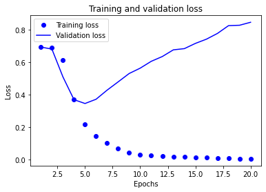
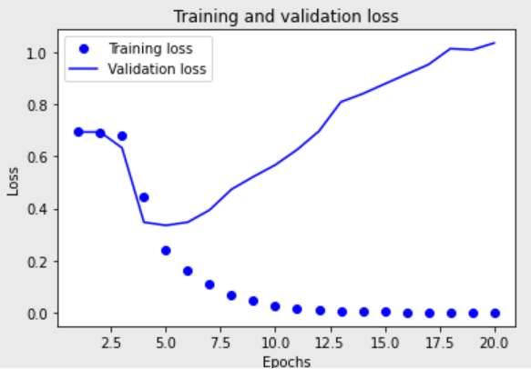

목표
영화에 대한 리뷰를 보고, 소비자의 평가를 파악할 수 있다. 아마 수치로 나오면 되겠지...? 일단 0,1로만 구분한다.

이론

embedding이란

lstm의 히든 레이어

GlobalMaxPooling1D()

verbose = 1 # 1이 있고, 2가 있고 하다 history를 보여주는 방식이다.

그래프를 훈련 하면서 바로 볼수 있게 띄울 수도 있다.

(x_train, y_train), (x_test, y_test) = imdb.load_data(num_words=10000)

word_to_index = imdb.get_word_index()

로 영화 리뷰 평가와 그대에한 타겟(0과1로 이루어짐)을 다운받고, 단어사전(임베딩 벡터 사전)을 다운받는다.

sentence padding에서 pre와 post 차이
일반적으로 pre가 좋다고 한다. RNN특성상? 뒤쪽에 영향을 많이 받기 때문입니다.
하지만, 여기서 굳이 RNN을 써야하는지 하는 생각이 듭니다. 각 단어의 특성에 따라 전체의 범주만 찾아주면 되니까?
CNN으로 모델을 만들고 20epochs만 돌려본 결과는 다음과 같습니다.
- pre로 해본 결과   

- post로 해본 결과

