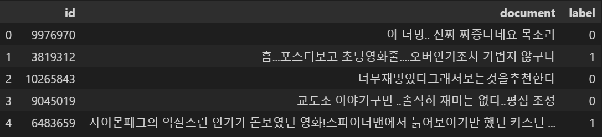

영화 평가 감성분석하기(한글!)
=
> ## 목차
> ---
> ### 1. 실행 방법   
> ### 2. 목표 및 의의   
> ### 3. 이론 [go](#3-이론)
>   > 1 토큰화와 임베딩    
>   > 2 pretrained model, 전이학습
>
> ### 4. 코드 분석 [go](#4-코드-분석)
>   > [0 코드 흐름](#0-코드-흐름)   
>   > [1 데이터 준비](#1-데이터-준비-및-전처리)    
>   > [2 모델 설계 및 실험](#2-모델-설계-및-실험)   
>   > [3 모델 평가](#3-모델-평가)   
> ### 5. 아쉬운 점 [go](#5-아쉬운-점)

<br><br><br>

- - - -

# 1. 실행 방법
## 1) 공사중...
 - 다음 라이브러리? 모듈? 들이 필요합니다. gensim3.8.3, konlpy  
git은 제거만 하셔도 됩니다.ㅎㅎ
pip install gensim==3.8.3 (한글 사전학습 임베딩 벡터 사용할때 여기 버전의 라이브러리 사용)  
이건 안해도 되지만 페이지 들어가서 소개를 보셔도 좋습니다.(git clone https://github.com/e9t/nsmc.git (한글 영화리뷰데이터))     
pip install konlpy (korea nlp 쪽 공동체인듯)

<br><br><br>

- - - -

# 2. 목표 및 의의

### 1) 언어의 임베딩에 대하여 이해한다.

### 2) 사전학습 모델(pretrained model)을 이용하여 보다 좋은 성과를 보이는 모델을 구현한다.  

### 3) 최종 모델이 한글 리뷰를 보면, 선플, 악플을 구분할 수 있다.

<br><br><br><br>

- - - - 
# 3. 이론

## 1) 토큰화와 임베딩

 - 토큰화   
    모델을 학습시키기 위해서는 사람이 사용하는 언어를 컴퓨터가 알수 있게 변환을 해야합니다. 평소처럼 인코딩을 하면 되는 것이 아닌지 생각할 수 있지만, 모델이 문장의 의미를 알게끔 학습시키는데에 있어서, 글자가, 각 자음, 모음단위로 저장된 상태로는, 직관적으로도 많이 어려움이 있을 수 있다는 생각이 듭니다. 이를 위해서 우리는 단어 하나하나를 하나의 숫자에 대응하게 변환을 할 것입니다. 이를 토큰화 라고 합니다. 여기서 바뀌는 숫자는 거의 아무 의미가 없이, 딕셔너리의 열쇠 같은 것이라고 생각 할 수 있습니다.

    그러면 이대로 학습을 진행하면 될까요? 아닙니다. 이 숫자들은 단어를 대표하기에는 적절할지 몰라도, 학습을 통해 수정되거나, 컴퓨터가 해석할 만한 어떤 의미를 내포하기에는 적절하지 않아요. 그도 그럴 것이 그냥 하나의 숫자일 뿐이고;; 예를 들면 45가 소세지, 46이 사랑, 이런식으로 전혀 관련없는 단어가 연속해서 등장할 수 있습니다. 단지 컴퓨터가 읽기 편하게 숫자로 변환시킨 것 뿐이니까요. 이를 특정 의미를 갖게 하려면 조금더 높은 차원이 필요합니다. 이를 임베딩이라고 합니다. 사실 지금 진행한 토큰화 역시 임베딩을 용이하게 하려는 전처리였는지 모르겠습니다.

 - 임베딩(Embedding)

    

    임베딩과정은 어떤 대상을 특정 차원의 벡터로 전환해주어, 여러개의 의미를 내포할 여지를 남깁니다. 벡터의 몇번째 차원이 어떤 의미를 가져야 한다고 정해져있는 것은 아니지만, 학습과정에서 여러개의 벡터 원소들이 어떤 값으로 정해지면서, 


### 


<br><br><br><br>

- - - -
# 4. 코드 분석


[목차](#영화-평가-감성분석하기한글)
- - - - 

## 0) 코드 흐름

Naver에서 영화 평가 리뷰를 데이터로 전처리를 하신 후 공유하신 감사한 분이 계시다.nsmc라는 이름으로 깃헙을 쓰고 계신데, 그분이 공유하는 text파일을 사용했다.
```python
train_path = 'data/nsmc/ratings_train.txt'
test_path = 'data/nsmc/ratings_test.txt'
train_data = pd.read_table(train_path)
test_data = pd.read_table(test_path)

train_data.head()
```


### 적절히 전처리를 하고 만든 모델에 넣어서 성능을 확인해 보겠습니다.
 - sentence padding에서 pre와 post 차이
일반적으로 pre가 좋다고 한다. RNN특성상? 뒤쪽에 영향을 많이 받기 때문입니다.
하지만, 여기서 굳이 RNN을 써야하는지 하는 생각이 듭니다. 각 단어의 특성에 따라 전체의 범주만 찾아주면 되니까?
CNN으로 모델을 만들고 20epochs만 돌려본 결과는 다음과 같습니다.
- pre로 해본 결과   


- post로 해본 결과


### 결과는 그닥입니다;;

### 생각해보니, CNN을 사용해서 그런 것이었군요! RNN을 시도해보겠습니다!


- - - -
## 5. 아쉬운 점

### 1) RNN이 더 문맥을 이해하기 적절하겠다는 결론을 내렸지만, 다소 큰 차이가 없고, 조금 아쉬운 면이 있습니다.

### 2) 분석 결과가 90%이상 나오는 것이 개인 목표였으나.. 너무 어렵군요ㅜㅜ 88%를 넘지 못합니다ㅜㅜ